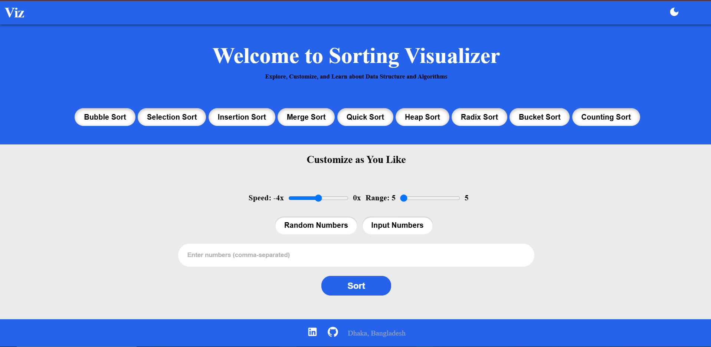

### **README.md**  

```md
# Sorting Algorithm Visualizer 🎨📊

Sorting Algorithm Visualizer is a **React.js** web application that visually demonstrates various sorting algorithms in action. This project helps users understand how different sorting techniques work through **real-time animations, comparisons, and step-by-step visualizations**.  

---

## 📸 Screenshots



---

## 🚀 Features

✅ **Multiple Sorting Algorithms** – Visualize Bubble Sort, Merge Sort, Quick Sort, Insertion Sort, Selection Sort, and more.  
✅ **Real-Time Animations** – Observe sorting in action with smooth visualizations.  
✅ **Speed Control** – Adjust the sorting speed to analyze step-by-step execution.  
✅ **Custom Array Size** – Modify the number of elements and generate random values.  
✅ **Algorithm Comparison** – Understand efficiency differences between sorting techniques.  
✅ **Simple & Intuitive UI** – Minimalist design for a better learning experience.  

---

## 🛠️ Tech Stack

- **React.js** (Frontend framework)  
- **JavaScript** (Algorithm implementation)  
- **HTML & CSS** (UI & Styling)  

---

## 📥 Installation & Setup  

Follow these steps to set up the project on your local machine:  

1️⃣ **Clone the Repository**  
```sh
git clone https://github.com/your-username/sorting-visualizer.git
```

2️⃣ **Navigate to the Project Directory**  
```sh
cd sorting-visualizer
```

3️⃣ **Install Dependencies**  
```sh
npm install
```

4️⃣ **Run the Application**  
```sh
npm start
```

5️⃣ **Open in Browser**  
Visit `http://localhost:3000/` to explore the sorting visualizer.

---

## 📌 How to Use

1️⃣ Select a sorting algorithm from the menu.  
2️⃣ Adjust the array size and sorting speed using the controls.  
3️⃣ Click **"Generate New Array"** to shuffle values.  
4️⃣ Hit **"Start Sorting"** to watch the algorithm in action.  
5️⃣ Observe the step-by-step visualization and compare performance.

---

## 🎯 Contributing  

We welcome contributions! If you’d like to improve this project, feel free to:  
- Fork the repository  
- Make changes & improvements  
- Submit a **Pull Request**  

---

## 📝 License  

This project is licensed under the **MIT License** – you’re free to use, modify, and distribute it.

---

## 📬 Contact  

👨‍💻 **Developer:** Your Name  
📧 **Email:** your.email@example.com  
🌐 **GitHub:** [your-username](https://github.com/your-username)  
💼 **LinkedIn:** [your-linkedin](https://linkedin.com/in/your-profile)  

---

🌟 **If you found this project helpful, consider giving it a ⭐ on GitHub!**  
